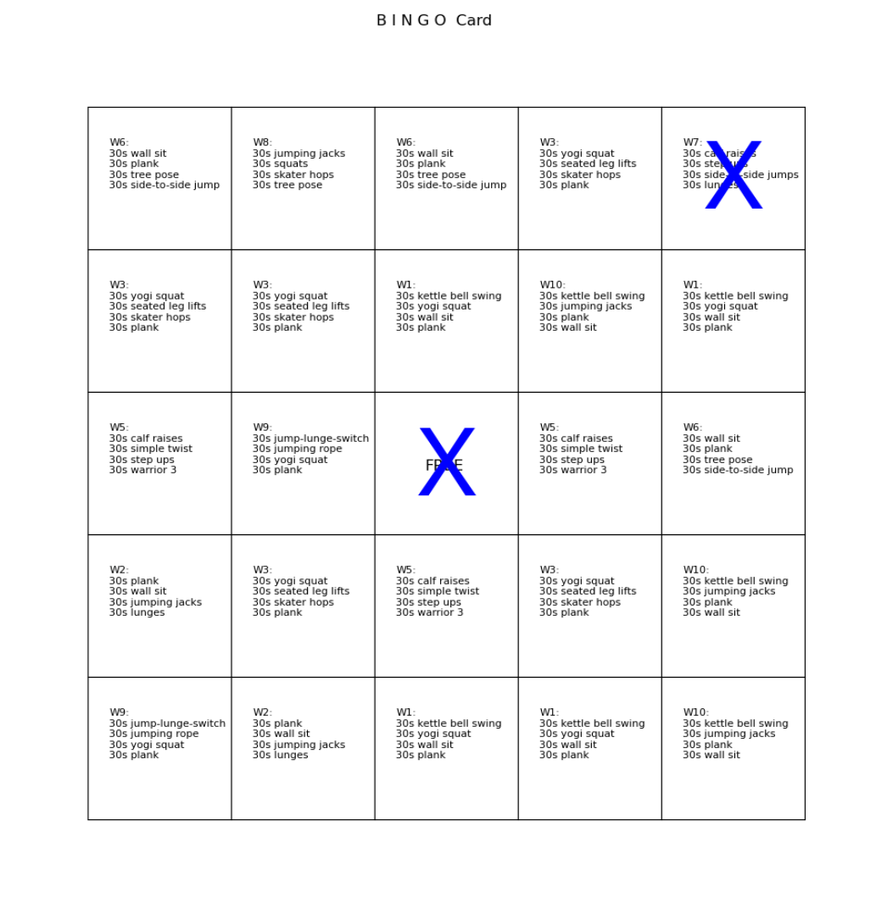

# workout-bingo
silly bingo game to get ready for skiing

This repo contains scripts I use to set up a fun workout bingo game.

Every Tuesday, Thursday, and Saturday my script (`bingoemail.py`)
picks a random workout and sends it to each player. 
Players have until the next workout
email to *do* the workout and reply "done" to the email. I have
`procmail` looking for "done" emails, and if they
reply done in time, and their bingo card has the workout, it
puts an "X" on their bingo card. Normal bing rules apply (first to
get 5 marks horizontal, vertical, or diagonal, wins).

Here's an example of the workout bingo card:



Scripts also do the following:
- parse incoming emails, looking for "done"
- create bingo card image file given a "state" file (says which squares are already "done")
- uses imagemagick to put "X" on given bingo card image file
- emails all once a player has won the game
- can set up a new game, given a file with a list of player emails

## setup

- add email addresses, one per line, to `.emails` file
- create `.variables` file with site-specific variables, like this:
```
$ vim .variables
$ cat .variables
# start of URL for games
START = https://yourserver/~yourusername
# who the game emails come from
EMAILFROM = youremail@yourdomain
# email server used to send the bingo emails
SERVER = your.email.server.fqdn
# path to workout-bingo dir
PATH = /home/yourusername/repos/workout-bingo
# prefix for email subject lines
PREFIX = [YourProcmailPrefix]
```

- run newgame.py to create new game files and directories
    - creates dir and card.txt file for each user
    - calls makecard.py on card.txt file
    - creates .done file
    - cron job below sends email that game is going
    - removes .nogame file (leftover from last game)
- set up procmail entry to look for [YourProcmailPrefix] Subject lines
- set up cron job to call `bingoemail.py` every T/Th/S
- add to/change quotes file if you want
- assumes START/public_html exists

# add emails
Add email addresses, one per line, to `.emails` file.

# add mark to image

See `markcard.py` for details on how imagemagick marks a card
at a specific location (e.g., i=2 (the column) and j=3 (the row)).

Using the following font and point size, it appears the
"center" of the top right square is `x=60` and `y=130`.
So the first `convert` command below (from imagemagick) is for the
top left square, then next down one, down two, down two over one,
and finally down two (530) over two (460).

Here's a simple example of running `convert` from the command line,
to put an "X" at a specific location (e.g., 60,130):

```
convert -font helvetica -fill blue -pointsize 100 -draw "text 60,130 'X'" card1.png output.png
convert -font helvetica -fill blue -pointsize 100 -draw "text 60,330 'X'" card1.png output.png
```

# cron entry

```
# bingo game at 8am, Tue/Thu/Sat
0 8 * * 2,4,6 python3 ~/repos/workout-bingo/bingoemail.py
```

# procmail entry

```
:0:
* ^Subject: Re: \[YourProcmailPrefix\] .*$
{
  :0 c
  aaa.IN.bingo

  :0
  | $HOME/repos/workout-bingo/processemail.py
}
```
